# Implementation Roadmap

Status: `Decision`; vendor/business inputs remain `TBD`  
Last reviewed: 2026-07-30

## Delivery principle

Build in dependency order. Search, consent, measurement, accessibility and form security are part
of each phase, not cleanup before launch. Do not start a later phase when its required facts would
force invented content or a throwaway integration.

```mermaid
flowchart LR
    F["0. Foundation"] --> D["1. Product discovery"]
    D --> S["2. Application scaffold"]
    S --> U["3. Design system + shell"]
    U --> C["4. Content + routes"]
    C --> L["5. Lead flow"]
    L --> M["6. Consent + measurement"]
    M --> Q["7. Search / Ads / quality QA"]
    Q --> R["8. Legal + production release"]
    R --> A["9. Campaign launch + learning"]
```

Some implementation work can overlap after its prerequisites are verified, but every phase keeps
the listed exit gate.

## Phase 0 — Foundation

Status: `Complete`

Deliverables:

- repository and temporary-work boundaries;
- source-of-truth hierarchy;
- Stitch visual contract;
- architecture and decision log;
- content/claims, search, Ads, measurement, consent and compliance plans;
- adapted execution guidance with third-party attribution.

Exit:

- mandatory root documents are present and consistent;
- internal links resolve;
- legacy donor material exists only in ignored `temp/`;
- application is still uninitialized.

## Phase 1 — Product and business discovery

Status: `Strategy drafted`; blocked by owner acceptance, technical inputs and validation

Confirm:

- exact physical product and correct German category;
- product families/options, technical limits and installation model;
- owner acceptance of the proposed B2B-only scope, primary segment and buying journey;
- actual German service area;
- quote, measurement, installation, maintenance and response process;
- company/legal/contact data;
- claim evidence, references, reviews and media rights;
- pricing/warranty policy;
- domain candidates and brand direction.

Outputs:

- owner-approved `../strategy/product-market-decision.md`;
- validation evidence against `../strategy/go-to-market-and-landing-brief.md`;
- approved product brief and route/intention map;
- claims register entries move from `TBD` to `Approved` or `Rejected`;
- asset manifest with owner/source/license;
- final v1 route list.

Exit:

- hero category and primary offer can be written truthfully;
- no core section depends on fake proof or unknown service capability.
- technical deliverability, paid demand and direct contribution pass the pre-set product gate.

## Phase 2 — Application scaffold

Status: `Intentionally not started`; blocked until Phase 1 product `GO`

Create:

- current stable Next.js 16 App Router project;
- strict TypeScript;
- pnpm version pinned through `packageManager`;
- Tailwind CSS 4 with CSS-first tokens;
- ESLint flat configuration and formatting convention;
- Vitest + Testing Library for focused unit/component tests;
- Playwright for E2E and accessibility paths;
- environment validation and `.env.example` without secrets;
- central `site`, `company` and `seo` config boundaries;
- route skeletons and production/preview indexing guard;
- CI commands for typecheck, lint, tests and build.

Do not add a CMS, global state library, animation framework or component kit without a concrete
need.

Exit:

- clean install and production build succeed;
- empty route shell has correct language, server rendering and environment behavior;
- no production IDs or personal data exist locally.

## Phase 3 — Design system and application shell

Status: `Not started`

Implement from `../../DESIGN.md`:

- local fonts after license verification;
- color, type, spacing, grid and motion tokens;
- semantic root layout, skip link, header/navigation and footer;
- buttons, links, inputs, containers and technical labels;
- mobile navigation and full focus behavior;
- responsive image primitives and stable media aspect ratios;
- consent-control placeholder that does not load tracking.

Verify:

- 320, 390, 768, 1024, 1280, 1440 and 1920px;
- keyboard, focus, 200% zoom, reduced motion and initial contrast;
- no horizontal overflow or layout shift from shell/fonts.

Exit:

- reusable primitives cover actual landing needs;
- visual comparison preserves Stitch direction without copying generated HTML.

## Phase 4 — Content and routes

Status: `Not started`

Implement:

- German landing sections from the approved content hierarchy;
- real reference/contact/legal route content when inputs exist;
- centralized metadata defaults and route-specific metadata;
- crawlable internal links and one consistent primary CTA;
- approved production media with alt/crop/dimensions;
- no placeholder trust signals in public output.

Exit:

- server HTML alone communicates the complete primary offer;
- each indexable route has unique intent and substantive content;
- every factual claim traces to the claims register.

## Phase 5 — Lead flow

Status: `Not started`

Implement:

- shared input schema and mandatory server validation;
- accessible fields, inline errors, summary/live announcement and pending/success states;
- persistence/CRM adapter selected after vendor decision;
- rate limiting, honeypot and safe error contract;
- idempotent submission and non-personal `lead_id`;
- operational notification without PII-rich logs;
- no contact data in URL or confirmation route.

Verify:

- success, invalid input, abuse, integration failure, retry/double-click and analytics-denied
  paths;
- accepted record and visitor state stay consistent.

Exit:

- a real inquiry is safely accepted exactly once and can be acted on by the business.

## Phase 6 — Consent and measurement

Status: `Blocked by CMP/account decisions`

Implement:

- selected CMP and documented vendor/data flow;
- Consent Mode v2 defaults before Google tag behavior;
- one GTM web container with separate production/test settings;
- typed analytics adapter and allowlisted parameters;
- event contract from `../marketing/measurement-plan.md`;
- `generate_lead` only from the accepted server result;
- deduplication and one primary Ads conversion source;
- persistent consent settings/revocation control.

Enhanced Conversions and offline conversion uploads remain disabled unless separately approved.

Exit:

- Reject, partial, Accept and revoke paths pass;
- Tag Assistant/DebugView show no PII and no duplicate primary conversions;
- form remains fully functional without optional consent.

## Phase 7 — Search, Ads and quality gate

Status: `Not started`

Implement and validate:

- titles, descriptions, canonical, Open Graph and server H1/content;
- production `robots.txt` and canonical-only sitemap;
- preview access control plus `X-Robots-Tag`;
- evidence-based JSON-LD;
- redirects, 404 and parameter behavior;
- Ads final URL/message match;
- WCAG-oriented automated/manual checks;
- mobile performance budget and Core Web Vitals;
- security headers, dependency and secret checks.

Exit:

- every item in `../seo/search-foundation.md`,
  `../marketing/google-ads-readiness.md` and applicable legal gates has evidence or a named
  blocker;
- no release blocker is silently waived.

## Phase 8 — Legal and production release

Status: `In progress`; local legal pages implemented, production vendor/review inputs blocked

Complete:

- final business-specific legal review of the implemented `Impressum` and `Datenschutzerklärung`;
- resolution and removal of every `data-legal-review="required"` marker; indexed production must
  remain fail-closed until the list is empty;
- CMP/vendor/processor disclosures and retention;
- production domain, DNS, HTTPS and preferred-host redirects;
- environment variables and protected preview;
- backups/lead recovery and operational ownership;
- production smoke, form and tag verification;
- Search Console Domain property and sitemap submission.

Production deployment is an explicit external action and requires user authorization.

Exit:

- production site, legal text and actual data flows match;
- release evidence is stored without secrets or real lead PII;
- rollback and responsible owner are known.

## Phase 9 — Google Ads launch and learning

Status: `Not started`

After the site gate passes:

- finalize keyword research and negatives from current Germany data;
- create ad groups by distinct intent;
- keep ad promise and landing evidence aligned;
- launch controlled campaigns only with explicit authorization;
- monitor destination health, search terms, conversion diagnostics and lead quality;
- refine content/routes from evidence, not vanity traffic.

Exit is ongoing: Ads and organic performance are operational processes, not a one-time build task.

## Cross-phase stop conditions

Stop and request owner input before:

- publishing unverified company/product facts;
- selecting a data processor or creating a new data flow;
- purchasing a domain/service or incurring spend;
- deploying production or publishing an Ads campaign;
- enabling first-party data upload, Enhanced Conversions or offline conversion uploads;
- creating a route whose search intent and unique value are unproven.
