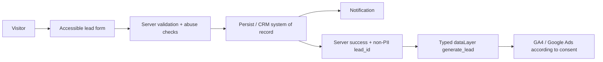

# System Architecture

Status: `Decision` with `TBD` integrations  
Last reviewed: 2026-07-30

## Goals

- Быстрый server-rendered немецкий landing.
- Production-ready lead flow.
- Google Search/Ads infrastructure from day one.
- Privacy/consent boundary suitable for Germany.
- Минимальный client JavaScript и понятная поддержка.
- Возможность сменить рабочее название без переписывания UI.

## Non-goals for v1

- Интернет-магазин и online contract.
- Account/client portal.
- Сложный CMS до появления реальной редакционной потребности.
- Marketplace.
- Массовые programmatic city pages.
- Server-side GTM и Enhanced Conversions без отдельного решения.

## Stack

| Layer | Decision |
| --- | --- |
| Framework | Current stable Next.js 16 App Router line; exact patch pinned at scaffold |
| Language | TypeScript strict |
| Package manager | pnpm, exact version pinned through `packageManager` |
| Rendering | Static/server-first; Client Components only for real interaction |
| Styling | Tailwind CSS 4 with CSS-first project tokens |
| Fonts | Self-hosted local WOFF2 |
| Validation | Zod shared schema + mandatory server-side validation |
| Forms | Server Action or Route Handler selected by simplest reliable integration |
| Tag management | One GTM web container; test/production configuration separated |
| Testing | Vitest + Testing Library; Playwright E2E + accessibility/performance checks |
| Hosting | `TBD`; must support HTTPS, preview isolation, EU-sensitive data handling |
| Lead system of record | Existing CRM if selected; otherwise `TBD` EU-capable persistence |
| CMP | `TBD`; must support granular consent and Consent Mode v2 |

Next.js provides App Router conventions for metadata, `robots.ts`, `sitemap.ts`, images and
fonts. Prefer built-in mechanisms over parallel SEO plugins.

## Planned routes

| Route | Purpose | Index policy |
| --- | --- | --- |
| `/` | Primary German landing | index |
| `/referenzen` | Real project evidence | index when substantive |
| `/kontakt` | Contact options and request entry | index |
| `/impressum` | Provider information | index |
| `/datenschutz` | Privacy information | index |
| `/anfrage/bestaetigt` | Post-submit state | noindex, not in sitemap |

Additional product/service routes require a validated search intent and unique useful content.
Do not generate empty route shells for hypothetical SEO.

## Source configuration boundaries

Planned sources:

- `src/config/site.ts` — working brand, production origin, locale and navigation.
- `src/config/company.ts` — verified legal/contact/service facts only.
- `src/config/seo.ts` — metadata defaults and canonical policy.
- `src/features/analytics/events.ts` — typed event names and allowed parameters.
- `src/features/consent/` — consent state and tag gating.
- `src/features/lead-form/` — schema, UI, server processing and result contract.
- `src/lib/structured-data/` — JSON-LD builders from verified config.

Copy, Ads and Schema may not maintain separate copies of company facts or claims.

## Rendering policy

- Important content, headings, navigation, metadata and JSON-LD are present in initial/server
  HTML.
- One responsive URL; mobile receives equivalent primary content and metadata.
- Native links are real `<a href>` elements.
- Dynamic interaction enhances the page but does not gate primary information.
- Static rendering is default for stable marketing/legal content.
- Runtime rendering is introduced only for actual runtime data.

## Lead flow

Rules:

- Server success occurs only after reliable acceptance/persistence.
- `lead_id` is random/non-personal and used for deduplication.
- Contact data never enters URL, page title, GA4 or generic dataLayer.
- A retry must not create uncontrolled duplicate conversions.
- Form submission works when analytics and marketing consent are denied.
- Vendor failure produces a safe user state and observable server-side error without logging
  PII.

## Consent and tag boot sequence

1. Render functional site without requiring analytics.
2. Initialize consent defaults before Google tag behavior.
3. Load CMP/consent layer.
4. Update `analytics_storage`, `ad_storage`, `ad_user_data` and `ad_personalization` from the
   visitor's choice.
5. Emit typed events with no PII.
6. Permit the relevant GA4/Ads destination according to the current consent state.
7. Allow the visitor to change/revoke the choice.

Basic versus Advanced Consent Mode remains `TBD` pending legal/privacy review. Architecture must
not hardwire a choice that cannot be changed.

## Environment policy

### Local

- No production IDs.
- Mock/stub integrations.
- Never indexed.

### Preview/staging

- Protected by access control.
- `X-Robots-Tag: noindex, nofollow`.
- No production canonical, sitemap submission or Ads final URL.
- Separate GTM preview/environment and test identifiers.
- Test data clearly separated from production.

`robots.txt Disallow` alone is not an indexing control because it can prevent a crawler from
seeing `noindex`.

### Production

- Only indexable environment.
- One canonical HTTPS host.
- Production IDs supplied through environment variables.
- Googlebot and AdsBot-Google can access content, CSS, JavaScript and images.
- Release check rejects auth, `noindex`, preview-domain canonical and test IDs.

## Security and privacy

- Secrets server-only.
- Server validation and normalized inputs.
- Rate limiting and honeypot by default; external CAPTCHA only if justified and documented.
- Origin/CSRF boundary verified.
- Security headers and HTTPS enforced.
- Logs redact request bodies, tokens and contact data.
- Processor/DPA inventory matches actual deployment.
- Retention and deletion path defined before collecting production leads.

## Quality gates

- Typecheck, lint, tests and production build.
- E2E happy path, validation errors, duplicate/retry and no-consent path.
- Keyboard and axe checks.
- Metadata, status, canonical, robots and sitemap inspection.
- Structured-data validation.
- Tag Assistant/DebugView and conversion deduplication.
- Mobile performance and Core Web Vitals budget.

## Open decisions

- Hosting and data region.
- CRM/system of record.
- Transactional email.
- CMP and Consent Mode implementation.
- Retention periods.
- Exact route set after keyword/product research.
