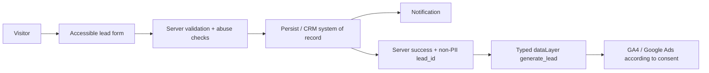

# System Architecture

Status: `Decision` with `TBD` integrations  
Last reviewed: 2026-08-11

Publication decisions follow [`publication-governance.md`](publication-governance.md). Environment
flags below describe code behavior; they do not autonomously forbid or authorize a release.

<!-- AGENT_BRIEF:START -->
## Agent brief

- Owns: application stack, routes, rendering, environments, lead storage/uploads and notifications.
- Current: Next.js 16 server-first app; unified lead records use Neon, private Blob and Resend;
  runtime capabilities remain environment-gated.
- Open: final hosting/CMP facts and production choices remain owner decisions.
- Read full when: changing framework boundaries, routes, runtime flags, persistence, uploads,
  notifications, environments or security boundaries.
<!-- AGENT_BRIEF:END -->

## Goals

- Быстрый server-rendered немецкий landing.
- Production-ready lead flow.
- Google Search/Ads infrastructure from day one.
- Privacy/consent boundary suitable for Germany.
- Минимальный client JavaScript и понятная поддержка.
- Возможность сменить рабочее название без переписывания UI.

## Non-goals for v1

- Интернет-магазин и online contract.
- Account/client portal.
- Сложный CMS до появления реальной редакционной потребности.
- Marketplace.
- Массовые programmatic city pages.
- Server-side GTM и Enhanced Conversions без отдельного решения.

## Stack

| Layer | Decision |
| --- | --- |
| Framework | Current stable Next.js 16 App Router line; exact patch pinned at scaffold |
| Language | TypeScript strict |
| Package manager | pnpm, exact version pinned through `packageManager` |
| Rendering | Static/server-first; Client Components only for real interaction |
| Styling | Tailwind CSS 4 with CSS-first project tokens |
| Fonts | Self-hosted local WOFF2 |
| Validation | Zod shared schema + mandatory server-side validation |
| Forms | Server Action or Route Handler selected by simplest reliable integration |
| Tag management | One GTM web container; test/production configuration separated |
| Testing | Vitest + Testing Library; Playwright E2E + accessibility/performance checks |
| Hosting | `TBD`; must support HTTPS, preview isolation, EU-sensitive data handling |
| Lead system of record | Neon PostgreSQL in `eu-central-1`; `leads` and `lead_files` schema migrated; intake is environment-gated |
| Lead file storage | Private Vercel Blob in `fra1`; direct client upload with server-authorized per-file paths, 5 × 15 MB and 50 MB combined limit |
| Lead notification | Resend Email API in `eu-west-1`; sending-only domain-scoped key, separate idempotent internal notification and customer receipt |
| CMP | `TBD`; must support granular consent and Consent Mode v2 |

Next.js provides App Router conventions for metadata, `robots.ts`, `sitemap.ts`, images and
fonts. Prefer built-in mechanisms over parallel SEO plugins.

## Planned routes

| Route | Purpose | Index policy |
| --- | --- | --- |
| `/` | Primary German landing | index |
| `/konfigurator` | Server-reproduced preliminary B2B-net configurator and shared project inquiry | index |
| `/referenzen` | Real project evidence | index when substantive |
| `/kontakt` | Contact options and request entry | index |
| `/impressum` | Provider information | index |
| `/datenschutz` | Privacy information | index |
| `/anfrage/bestaetigt` | Post-submit state | noindex, not in sitemap |

Additional product/service routes require a validated search intent and unique useful content.
Do not generate empty route shells for hypothetical SEO.

## Source configuration boundaries

Planned sources:

- `src/config/site.ts` — working brand, production origin, locale and navigation.
- `src/config/company.ts` — verified legal/contact/service facts only.
- `src/config/seo.ts` — metadata defaults and canonical policy.
- `src/features/analytics/events.ts` — typed event names and allowed parameters.
- `src/features/consent/` — consent state and tag gating.
- `src/features/lead-form/` — shared schema, UI, server processing and result contract for every
  plain, configurator and calculator inquiry; the cross-route product contract is
  [`unified-lead-form-contract.md`](unified-lead-form-contract.md).
- `src/features/configurator/` — versioned full configuration, server-compatible WOFF2 metrics,
  geometry validation, integer-cent pricing, panel allocation and browser-session migration. Server
  modules are marked `server-only`; client components receive only serializable results.
- `src/lib/structured-data/` — JSON-LD builders from verified config.

Copy, Ads and Schema may not maintain separate copies of company facts or claims.

## Rendering policy

- Important content, headings, navigation, metadata and JSON-LD are present in initial/server
  HTML.
- One responsive URL; mobile receives equivalent primary content and metadata.
- Native links are real `<a href>` elements.
- Dynamic interaction enhances the page but does not gate primary information.
- Static rendering is default for stable marketing/legal content.
- Runtime rendering is introduced only for actual runtime data.

## Lead flow

All present and future request entry points use one lead system. Optional configurator/calculator
context extends the accepted lead instead of creating a parallel form pipeline or conversion. The
authoritative expansion contract is
[`unified-lead-form-contract.md`](unified-lead-form-contract.md).

Rules:

- Server success occurs only after reliable acceptance/persistence.
- `lead_id` is random/non-personal and used for deduplication.
- Contact data never enters URL, page title, GA4 or generic dataLayer.
- A retry must not create uncontrolled duplicate conversions.
- Form submission works when analytics and marketing consent are denied.
- Vendor failure produces a safe user state and observable server-side error without logging
  PII.
- The customer receipt contains only the public request number and service copy. Its delivery
  failure is logged without contact data and does not reverse an already accepted lead.
- File content goes directly to Private Blob after the server reserves a `lead_files` row and
  authorizes its exact random pathname. PostgreSQL stores metadata, never the binary content.
- Full-configurator submissions store one optional allowlisted `request_context` JSONB snapshot on
  the same `leads` row. The client supplies raw inputs and a confirmed pricing version; the server
  validates and recalculates before persistence. Plain inquiries keep this field null.
- Upload grants expire after 30 minutes. Accepted leads and their private files have a 90-day
  retention deadline enforced by the protected daily retention job.
- Notification file links are HMAC-signed, contain only random lead/file identifiers and expire
  after seven days; downloads stream private Blob content through a no-store server route.
- The form combines a honeypot with an email-based three-attempts-per-15-minute application limit.
  Production contact intake defaults fail-closed through `LEAD_INTAKE_ENABLED=false`. Its value for
  a concrete release is `Спросить у пользователя`. File intake is an additional dependent technical
  control: the former mandatory `LEAD_ATTACHMENTS_ENABLED=false` publication baseline is
  superseded. Show the malware/processor facts and ask the user for the concrete value; a forged
  file manifest is rejected while an enabled contact-only flow continues to work.

## Consent and tag boot sequence

1. Render functional site without requiring analytics.
2. Initialize consent defaults before Google tag behavior.
3. Load CMP/consent layer.
4. Update `analytics_storage`, `ad_storage`, `ad_user_data` and `ad_personalization` from the
   visitor's choice.
5. Emit typed events with no PII.
6. Permit the relevant GA4/Ads destination according to the current consent state.
7. Allow the visitor to change/revoke the choice.

Basic versus Advanced Consent Mode remains `TBD` pending legal/privacy review. Architecture must
not hardwire a choice that cannot be changed.

## Environment policy

### Lead runtime contract

The enabled lead flow requires these server-only values:

| Variable | Production value / source |
| --- | --- |
| `LEAD_NOTIFICATION_TO` | `info@lichtsaum.com` |
| `LEAD_EMAIL_FROM` | `LICHTSAUM Website <info@lichtsaum.com>` |
| `RESEND_API_KEY` | Resend sending-only key restricted to `lichtsaum.com` |
| `LEAD_DOWNLOAD_SECRET` | Independent random secret of at least 32 characters |
| `DATABASE_URL` | Neon pooled runtime URL |
| `DATABASE_URL_UNPOOLED` | Neon direct URL for migrations only |
| `BLOB_STORE_ID` | Private Vercel Blob store ID |
| `BLOB_READ_WRITE_TOKEN` | Local/non-OIDC Blob credential; server-only |
| `CRON_SECRET` | Independent secret for the retention endpoint |
| `SITE_URL` | Absolute deployed origin used in signed notification links |
| `LEAD_INTAKE_ENABLED` | Concrete production value: `Спросить у пользователя`; absent/`false` remains the code default |
| `LEAD_ATTACHMENTS_ENABLED` | Concrete production value: `Спросить у пользователя` after showing malware/processor facts; absent/`false` remains the code default |

No variable in this contract may use the `NEXT_PUBLIC_` prefix. Deployment classification uses
Vercel's system-provided `VERCEL_ENV`; no custom environment selector is required.

When production intake is requested, the application fails its server-render preflight unless a
runtime PostgreSQL URL and the required Resend values are present. Attachment activation also
requires the contact-intake flag, Blob credential, retention secret, download secret and absolute
HTTPS `SITE_URL`. Errors report variable names only and never secret values. This validates
configuration shape, not database reachability, migration state or provider delivery; those remain
release checks.

### Local

- No production IDs.
- Mock/stub integrations.
- No deployment-specific SEO headers or metadata; localhost is not a public deployment.

### Preview/staging

- Protected by access control.
- `X-Robots-Tag: noindex, nofollow`.
- No production canonical, sitemap submission or Ads final URL.
- Separate GTM preview/environment and test identifiers.
- Test data clearly separated from production.

`robots.txt Disallow` alone is not an indexing control because it can prevent a crawler from
seeing `noindex`.

### Production

- Only indexable environment.
- One canonical HTTPS host.
- Production IDs supplied through environment variables.
- Googlebot and AdsBot-Google can access content, CSS, JavaScript and images.
- Release check rejects auth, `noindex`, preview-domain canonical and test IDs.

## Security and privacy

- Secrets server-only.
- Server validation and normalized inputs.
- Rate limiting and honeypot by default; external CAPTCHA only if justified and documented.
- Origin/CSRF boundary verified.
- Security headers and HTTPS enforced.
- Logs redact request bodies, tokens and contact data.
- Processor/DPA inventory matches actual deployment.
- Retention and deletion path defined before collecting production leads.

## Quality evidence

These checks produce evidence for the owner; they do not decide publication by themselves.

- Typecheck, lint, tests and production build.
- E2E happy path, validation errors, duplicate/retry and no-consent path.
- Keyboard and axe checks.
- Metadata, status, canonical, robots and sitemap inspection.
- Structured-data validation.
- Tag Assistant/DebugView and conversion deduplication.
- Mobile performance and Core Web Vitals budget.

## Open questions — `Спросить у пользователя`

- Hosting and data region.
- Operational access policy for the Neon lead store and Private Blob files.
- Final legal/processor approval for Resend transactional email.
- CMP and Consent Mode implementation.
- Retention periods.
- Exact route set after keyword/product research.
