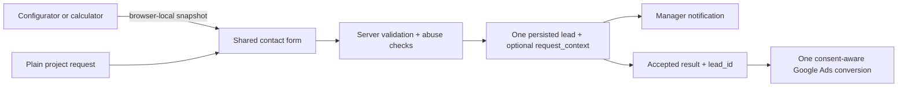

# Unified Lead Form and Conversion Contract

Status: `Decision`

Last reviewed: 2026-08-11

> Publication and production-form choices follow
> [`publication-governance.md`](publication-governance.md). Gaps below are evidence to show the
> owner, not autonomous release blockers.

<!-- AGENT_BRIEF:START -->
## Agent brief

- Owns: one shared inquiry contract across plain and configurator entry points, including attached
  context and the server-confirmed Primary Ads conversion boundary.
- Current: shared validation, persistence/result contract, notifications and optional files are
  implemented; configurator input is not a lead before explicit form submission.
- Open: release-state, abuse hardening and attachment malware/processor choices remain current work.
- Read full when: changing form fields, schema, configurator snapshot, persistence, notifications,
  idempotency, files or conversion semantics.
<!-- AGENT_BRIEF:END -->

## Purpose and ownership

Этот документ — единственный источник истины для:

- единой модели формы проектной заявки;
- прикрепления данных полного конфигуратора/калькулятора к заявке, включая draft, перенесённый из
  homepage mini-configurator;
- различия между UI-экземплярами формы и единой серверной системой приёма;
- содержимого, которое получает менеджер;
- связи принятой заявки с единственной Primary-конверсией Google Ads;
- правил расширения формы новыми контекстами и полями.

Точный словарь analytics events, разрешённые параметры, consent-gating и настройки Google
принадлежат [`../marketing/measurement-plan.md`](../marketing/measurement-plan.md). Архитектура
хранения, загрузки файлов и уведомлений принадлежит
[`system-architecture.md`](system-architecture.md). Retention (срок хранения), processor и
privacy-правила принадлежат
[`../legal/data-processing-and-consent.md`](../legal/data-processing-and-consent.md).

## Accepted decision

LICHTSAUM использует **одну систему проектных заявок** и **один бизнес-результат lead** независимо
от точки входа:

- обычный `Projekt-Check` — проверка проекта без конфигурации;
- заявка из реализованного полного конфигуратора/калькулятора, в том числе после переноса mini
  draft с главной;
- возможные будущие страницы, если они ведут к той же проверке проекта.

На разных страницах могут существовать отдельные HTML-экземпляры и разные композиции общей формы.
Это не отдельные lead-системы. Они используют общий контактный контракт, одну серверную
валидацию, одну persistence boundary, один формат результата, одну operational notification
pipeline и одну Primary conversion action Google Ads.

Нельзя создавать параллельную «форму калькулятора» с собственной таблицей заявок, отдельной
логикой успеха или второй Primary-конверсией только потому, что в ней больше исходных данных.

## User journeys

| Entry context | Visible form behavior | Attached lead context |
| --- | --- | --- |
| Обычная заявка | Текущая low-friction форма: обязательный e-mail, необязательные телефон, сообщение и файлы | `plain`; конфигурация отсутствует |
| Мини-конфигуратор | Crawlable CTA переносит browser-local draft на `/konfigurator`; homepage project-check сам по себе остаётся plain | Контекст не прикладывается напрямую; после migration и submit создаётся full snapshot |
| Полный конфигуратор/калькулятор | Общий контактный блок в третьем шаге после видимых исходных данных и preliminary result | Версионированный server-authoritative snapshot полной конфигурации, services, optional PLZ и calculation |

Пользователь не вводит повторно размеры, оформление или результат расчёта в контактной части.
Контекст показывается перед submit как неизменяемая сводка и предоставляет понятный путь `Ändern`
/ «изменить» через предыдущие шаги. Plain inquiry без контекста остаётся доступна через обычный
homepage project-check. Конкретная визуальная композиция определяется `DESIGN.md`, но видимость
прикладываемых данных обязательна.

Контактная форма остаётся low-friction. Начать заявку без конфигурации всегда можно. Размеры,
файлы, тип объекта, завершённая конфигурация и marketing consent не становятся обязательными
только из-за расширения конфигуратора.

## Transmission boundary

Ввод в конфигураторе сам по себе не отправляет данные LICHTSAUM и не создаёт lead.

До явной отправки контактной формы допускается только stateless server calculation, необходимый
для показанного пользователю результата: application runtime получает allowlisted raw
configuration, повторяет font metrics/geometry/price и возвращает результат без persistence,
notification, analytics или логирования body. Во всём остальном:

- versioned draft остаётся в `sessionStorage`; PLZ, contacts and files там не сохраняются;
- Google Ads conversion не создаётся;
- менеджер не получает уведомление;
- серверная lead-запись не создаётся только из-за взаимодействия с инструментом.

При submit клиент прикладывает видимый пользователю snapshot к контактным данным. Сервер не
доверяет скрытым полям или client-calculated values: он проверяет версию и структуру контекста,
повторно валидирует допустимые значения и отклоняет неизвестные поля.

Невалидный или незавершённый draft конфигуратора не должен блокировать обычную проектную заявку.
Если пользователь явно оставляет такой контекст прикреплённым, менеджер получает его со статусом
`incomplete` или `invalid`, без утверждения совместимости или цены. Предварительный расчёт можно
прикреплять только из версии контракта, для которой сервер способен подтвердить inputs и повторить
расчёт.

## Unified lead record

Одна успешная отправка создаёт одну запись `lead` с общим ядром:

- случайный неперсональный `lead_id`;
- idempotency key для защиты от повторного submit;
- статус;
- контактные данные;
- свободное сообщение пользователя;
- source path;
- разрешённая attribution/consent информация, когда соответствующий flow активирован;
- файлы через существующий `lead_files` contract;
- необязательный структурированный `request_context`.

`request_context` — версионированный, server-validated объект, а не сериализованный текст в
`project_context`. Минимальная семантика:

```text
schema_version
origin: plain | mini_configurator | full_configurator | calculator
configuration: optional structured snapshot
evaluation: optional incomplete | invalid | valid | manual_review
calculation: optional { version, inputs, preliminary_result, presentation }
```

Фактические типы и поля добавляются только вместе с реальным UI-сценарием. Не использовать
открытый `Record<string, unknown>` без runtime allowlist. Если отдельные значения позже нужны для
операционного поиска или отчётности, их можно нормализовать после появления второго реального
query-сценария; исходный контракт всё равно остаётся версионированным.

### Calculator rule

Future calculator values are never accepted as an authoritative client price. Before persistence,
the server must use the approved calculation version to reproduce the result from validated
inputs. The stored snapshot identifies the calculation version and the exact presentation shown
to the visitor, including applicable preliminary/VAT/scope wording.

ADR-015 closes the implementation gate only for the restricted `/konfigurator` preliminary
B2B-net result in [`configurator-calculation.md`](configurator-calculation.md). It does not approve a
general tariff, consumer Gesamtpreis, installation scope or binding offer.

## Manager notification

Каждая принятая заявка использует существующую idempotent internal notification pipeline. Письмо
менеджеру должно сохранять понятное разделение:

1. публичный номер заявки;
2. контакт и свободное сообщение;
3. source/origin заявки;
4. `Konfiguration` — конфигурация, если она приложена;
5. `Vorläufige Einschätzung` — предварительная оценка и версия расчёта, если разрешены;
6. файлы через существующие защищённые ссылки.

Отсутствующий контекст не изображается как ошибка. `Incomplete`, `invalid`, `manual_review` и
`preliminary` должны быть видимы менеджеру и не превращаться в техническое одобрение проекта.
Customer receipt (подтверждение клиенту) для plain inquiry остаётся кратким. Для принятого
`full_configurator` snapshot оно дополнительно повторяет видимую конфигурацию, выбранные услуги и
зафиксированный server net total, чтобы клиент мог проверить отправленный контекст. Свободное
сообщение, filename, содержимое файлов и download links в customer receipt не включаются.

## Google Ads conversion contract

Все entry contexts приводят к одной business conversion: server-confirmed project inquiry.
Существующая Google Ads action `Projektanfrage – serverbestätigt` остаётся единственной Primary
conversion source.

`generate_lead` разрешён только после того, как:

1. сервер получил submit;
2. контактные данные, request context и файлы прошли применимые проверки;
3. abuse controls пройдены;
4. lead надёжно сохранён в system of record;
5. сервер вернул тот же случайный неперсональный `lead_id`, который относится к принятой записи.

Не являются conversion: interaction с конфигуратором, scroll к форме, CTA click, показ
предварительной оценки, client-valid form, начало upload, submit attempt, thank-you view без
подтверждённой persistence или отправка operational e-mail сама по себе.

Один принятый lead создаёт не более одного conversion event для данного `lead_id`. Double-click и
same-page retry после потерянного Server Action response используют application idempotency и Ads
Transaction ID deduplication. Fresh navigation не воспроизводит заявку автоматически; намеренно
изменённая или новая заявка создаёт новый `lead_id`.

Разные UI-экземпляры могут иметь разные контролируемые `form_id`/`form_location` для funnel
диагностики, например будущий `calculator_inquiry`. Это не создаёт отдельную Primary conversion
action. `lead_type` не расширяется, пока не появляется реальная операционная маршрутизация или
другой business outcome.

Ни контактные данные, ни надпись, размеры, цвета, свободный текст, filename, price/estimate или
другие значения `request_context` не передаются в GA4, generic `dataLayer` или Google Ads. Google
boundary получает только поля, разрешённые measurement plan; `lead_id` используется только как
Ads Transaction ID. Форма и сохранение заявки работают без Analytics/Marketing consent; отправка
Google event подчиняется текущей consent-модели.

## End-to-end sequence



## Expansion rules

Любое будущее расширение формы обязано:

1. расширять общий lead contract, а не создавать параллельный intake;
2. сохранять общие contact, validation, abuse, idempotency, persistence и error boundaries;
3. добавлять версионированный и allowlisted context;
4. показывать пользователю прикладываемые данные до submit;
5. не требовать повторного ввода данных конфигуратора;
6. не превращать необязательный project context в обязательный барьер;
7. оставлять ровно одну Primary Google Ads conversion для того же business outcome;
8. не передавать context/PII в analytics;
9. обновлять privacy/data-flow documentation до production activation;
10. добавлять новый vendor, CRM, Enhanced Conversions или offline upload только после отдельного
    owner/legal/data-flow решения.

Отдельная lead-система или отдельная Primary conversion допустима только после явно записанного
решения, что появился другой business outcome, другой операционный владелец и отдельная модель
качества/ставок. Различие страниц или количества полей само по себе недостаточно.

## Current implementation and release gaps

Status: `Verified` on 2026-08-11

- Мини-конфигуратор создаёт versioned non-personal `sessionStorage` snapshot, а полный
  `/konfigurator` мигрирует совместимый v2-черновик в свой v1-контракт; PLZ, контакты и файлы в
  browser storage не входят.
- Полный конфигуратор передаёт в общую форму только исходную конфигурацию, услуги, optional PLZ и
  подтверждённую pricing version. Сервер заново валидирует и рассчитывает результат, не доверяя
  client total; stale pricing version возвращает обновлённый расчёт до создания lead и требует
  повторного подтверждения.
- Успешная configurator request сохраняет authoritative v1 snapshot в nullable
  `leads.request_context`; plain lead сохраняет `null`. Additive Drizzle migration применена к
  production Neon 2026-08-11; marker и nullable `jsonb` column независимо проверены. Само
  configurator application deployment ещё не выполнено.
- Общий manager notification и customer receipt показывают номер заявки, конфигурацию, услуги,
  распределение панелей и preliminary net result. Customer receipt по-прежнему не содержит текст
  сообщения или файлы.
- Существующий analytics adapter остаётся единственным путём `main_inquiry` / `awning_inquiry` и
  не получает конфигурацию, PLZ, услуги, pricing version или estimate value; pricing mismatch даёт
  zero conversion.
- LeadForm создаёт high-entropy attempt key/token для canonical fingerprint текущего payload и
  сохраняет их только в памяти страницы. Сервер strict-validates attempt, хранит только hash
  upload token и опирается на существующий unique `leads.idempotency_key`: same-page retry с тем же
  payload восстанавливает тот же upload plan или уже принятый `lead_id`, а изменённый payload не
  может присоединиться к существующей заявке. Синхронный client lock дополнительно закрывает
  double-submit до первого React render.
- Existing abuse baseline combines the empty honeypot with a case-insensitive three-per-email /
  15-minute window. The count/insert sequence is not an atomic multi-dimensional limiter and has
  no trusted network/global circuit-breaker dimension; that hardening remains a named production
  open security finding to show the owner rather than a claim that the local configurator is
  bot-proof.
- The Google Ads action and consent-aware GTM workspace are configured, but the container remains
  unpublished and production Google tag flags remain disabled. This architecture decision does not
  authorize publication or production activation.
- Production application deployment, controlled real-delivery verification, rendered production
  crawl, Tag Assistant and Ads Diagnostics remain release work outside this local implementation.

## Verification gate for implementation

Перед признанием расширения готовым проверить минимум:

- plain request сохраняется и отправляется без конфигурации;
- mini/full/calculator request сохраняет точный видимый snapshot;
- пользователь может изменить или удалить context до submit;
- незавершённый context не блокирует plain request и имеет честный статус;
- server rejects unknown schema versions/fields and does not trust client totals;
- manager notification показывает правильный origin, context и preliminary status;
- accepted record вызывает ровно один `generate_lead` с тем же `lead_id`;
- invalid, failed persistence и abandoned configuration дают zero conversions;
- retry/double-click/recovered success не создают duplicate conversion;
- plain/configurator/calculator paths работают при отказе от optional consent;
- Google requests не содержат contact, configuration, message, filename или estimate values;
- retention/deletion удаляет request context вместе с lead;
- Tag Assistant, Ads Diagnostics и persistence evidence подтверждают end-to-end результат.
